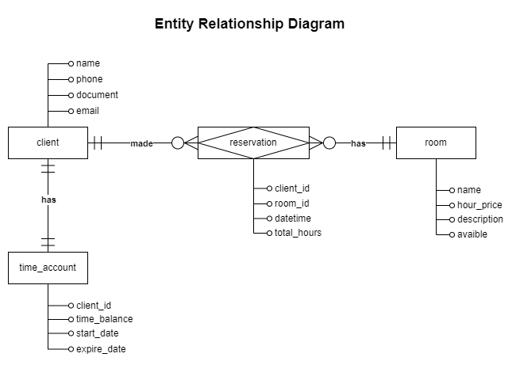

# Design Document

By HANDERSON GLEBER DE LIMA CAVALCANTI

Video overview: <URL HERE>

## Scope

In this section you should answer the following questions:

* What is the purpose of your database?
    The purpose of the database is to manage room reservations, track client time balances, and handle the association between clients and rooms.

* Which people, places, things, etc. are you including in the scope of your database?

    The database includes:

    - Clients: their identification, contact details, and time balances.
    - Rooms: their availability, hourly rates, and reservation status.
    - Reservations: linking clients to specific rooms for designated time periods.

* Which people, places, things, etc. are *outside* the scope of your database?
Employee data (e.g., staff schedules, payroll)

    The database NOT include:
    - Detailed financial transactions (e.g., payment methods, invoices)
    - Room maintenance and inventory (e.g., cleaning schedules, equipment tracking)
    - Advanced client interactions (e.g., communication logs, support tickets)

## Functional Requirements

In this section you should answer the following questions:

* What should a user be able to do with your database?
    The user should be able to :
    - Manage Clients:Add new clients with their information, Update existing client details, View client lists and individual client information.
    - Manage Rooms: Add new rooms with pricing and availability, Update room details, View room lists and individual room information.
    - Manage Reservations: Make new reservations for clients, assigning rooms and durations,View and update existing reservations, Cancel reservations.
    - Manage Time Accounts: View client time balances, Add time to client accounts.

* What's beyond the scope of what a user should be able to do with your database?
    Falls outside the scope of user actions:
    - Financial Operations: Processing payments or generating invoices. Accessing detailed financial reports.
    - Employee Management: Managing staff schedules or payroll. Accessing employee performance data.
    - Room Maintenance: Scheduling cleaning or repairs. Managing room inventory or equipment.

## Representation

### Entities

* Which entities will you choose to represent in your database?
    Clients
    Rooms
    Time Accounts
    Reservations

* What attributes will those entities have?
    Clients: id, name, phone, document, email
    Rooms: id, name, hour_price, available
    Time Accounts: id, client_id, time_amount, expire_date, start_date
    Reservations: id, client_id, room_id, datetime, total_hours

* Why did you choose the types you did?
    Types were chosen to accurately represent the data:
        VARCHAR for names, phone numbers, etc.
        INT for IDs and time amounts.
        DECIMAL for the hourly price.
        BOOLEAN for room availability.
        DATETIME for reservation times.

* Why did you choose the constraints you did?
    Constraints ensure data integrity:
        NOT NULL enforces required fields.
        AUTO_INCREMENT for automatic ID generation.
        PRIMARY KEY uniquely identifies each record.
        FOREIGN KEY establishes relationships between tables.
        DEFAULT provides default values for certain fields.

### Relationships

In this section you should include your entity relationship diagram and describe the relationships between the entities in your database.

## Optimizations

In this section you should answer the following questions:

* Which optimizations (e.g., indexes, views) did you create? Why?

## Limitations

In this section you should answer the following questions:

* What are the limitations of your design?
* What might your database not be able to represent very well?
